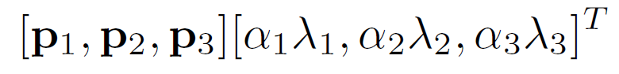

현재 CNN의 기반이 되는 모델인 AlexNet 논문 리뷰를 하였다.

## Abstract

- 데이터: ImageNet LSVRC-2010 & ImageNet LSVRC-2012
    - 1.2M개
    - high-resolution
    - 1000 classes
- 성과: SOTA 달성
- 모델 구조
    - 60M parameteres
    - 650,000 neurons
    - 5 Conv-layers (some w/ max-pooling layers)
    - 3 FC-layers
    - 1000-way softmax
- 학습 환경
    - 속도: non-saturating neurons, GPU
    - FC layer에서의 overfitting 방지위해 dropout 사용

## 1. Introduction

딥러닝 연구에서 large data가 필요하고, 최근들어 생기고  있음

## 2. The Dataset

- 데이터: ImageNet LSVRC-2010 & ImageNet LSVRC-2012
    - 1.5M (1.2M train set, 50,000 validation set, 150,000 test set)
    - high-resolution
    - 1000 classes (each roughly 1000 images)
- Error Rate
    - top-1 accuracy: softmax의 output에서 제일 높은 수치를 가지는 값을 예측한 경우 맞음
    - top-5 accuracy: softmax의 output에서 높은 5개의 class 중 예측한 class가 존재하는 비율
- ImageNet의 데이터의 variable-resolution images를 constant input dim으로 맞추기 위해 이미지를 fixed-resolution인 256*256으로 down-sample함

## 3. The Acrchitecture

### 3.1 ReLU Nonlinearlity

- Saturating Nonlinear Activation functions
    - $f(x) = tanh(x)$
    
    - $f(x) = sigmoid(x) = (1+e^{-x})^{-1}$
    
    - 느림
    
    - (x가 무한대로 갈 때 함수의 값이 특정 범위 내에서 움직이는 것)
- Non-Saturating Nonlinear Activation functions
    - $f(x) = ReLU(x) = max(0,x)$
    
      빠름 (기울기가 0에 가까운 경우 제외됨)
    
    - (x가 무한대로갈 때 함수의 값이 무한대로 가는 것)

​						—————————— ReLU             - - - - - - - - - - - - - - tanh

error 25%에 ReLU가 훨씬 빨리 도달함

- CNN의 속도를 향상시키기 위해 과거에도 nonlinear한 모델인 
  $
  f(x) = |tanh(x)|
  $
  를 사용한 적이 있지만, 빠른 속도보다는 overfitting에 초점을 맞춘 함수

### 3.2 Training on Multiple GPUs

- 2 GPU(GTX 580 (3GB))s
- cross-GPU parallelization: host machine memory에 접근하지 않고 서로의 메모리에 접근 가능
- GPU는 특정 layer에서만 서로 교류함
- cross-validation 문제가 발생할 수 있지만, 계산에 유리

### 3.3 Local Response Normalization

- ReLU는 일반적으로 normalization이 불필요하지만, 양수값을 input으로 받으면 그 값을 그대로 neuron에 전달하기 때문에 너무 큰 값이 전달되어 주변의 낮은 값이 neuron에 전달되지 못할 수 있음. 다음의 방법이 generalization을 도움

$$
b^{i}_{x,y} = a^{i}_{x,y}/(k+\alpha\sum\limits_{j=max(0,i-n/2)}^{min(N-1,i+n/2)}(a^{j}_{x,y})^2)^\beta
$$

- n: 해당 위치에서의 adjacetn kenrnel maps
- N: 해당 layer에서의 kernel 수 총합

- a: x,y위치에 적용된 i번째 kernel의 ouput

- neuron의 ouput을 주변값과 평균내는 것

[)

- 특정 노드의 출력이 주변에 비해 굉장히 크다면 학습시 이 노드에 편향될 수도 있는데, LRN은 이러한 효과를 억제시킬 수 있음
- (현재는 batch norm, group norm 등 더 나은 normalization 기법이 있기 때문에 사용 X)

### 3.4 Overlapping Pooling

- pooling layer에서 stride보다 더 큰 필터를 사용하여 receptive filed가 겹치게끔 함

    (stride < kernel)

    

- (현재는 잘 사용하지 않음)

### 3.5 Overall Architecture

- input layer - conv1 - maxpool1 - norm1 - conv2 - maxpool2 - norm2 - conv3 - conv4 - conv5 - maxpool3 - FC1 - FC2 - ouput layer

- DIMENSIONS
    1. Input layer
        - 224*224*3
    2. Conv1
        - 96 kernels of 11*11, s=4, p=0
        - input : 224*224*3
        - output : 55*55*96
    3. Maxpool1
        - 3*3 kernels, s=2
        - input: 55*55*96
        - output: 27*27*96
        - $n_H*n_W*n_C$  —(pooling)—>   $[{n_H-f\over s}+1]*[{n_W-f\over s}+1]*n_C$
    4. Norm1
        - LRN
        - input: 27*27*96
        - ouput: 27*27*96
    5. Conv2
        - 256 kernels of size 5*5, s=1, p=2
        - input: 27*27*96
        - output: 27*27*256
    6. MaxPool2
        - 3*3 kernels, s=2
        - input: 27*27*256
        - output: 13*13*256
    7. Norm2
        - LRN
        - input: 13*13*256
        - output: 13*13*256
    8. Conv3
        - 384 kernels of size 3*3, s=1, p=1
        - input: 13*13*256
        - output: 13*13*386
    9. Conv4
        - 384 kernels of size 3*3, s=1, p=1
        - input: 13*13*386
        - output: 13*13*384
    10. Conv5
        - 256 kernels of size 3*3, s=1, p=1
        - input: 13*13*384
        - output: 13*13*256
    11. MaxPool3
        - 3*3 kernels, s=2
        - input: 13*13*256
        - output: 6*6*256
    12. FC1
        - input: 6*6*256
        - output: 4096
        - (dropout)
    13. FC2
        - input: 4096
        - output: 4096
        - (dropout)
    14. FC3(output layer)
        - FC w/ 1000-way softmax
        - input: 4096
        - output: 1000

## 4. Reducing Overfitting

### 4.1 Data Augmentation

- label-preserving transformation: data-augmentation을 수행해도 label이 바뀌지 않도록 하는 것 (ex. 6을 상하반전하면 9)
1. Generating Image Translations and Horizontal Reflections
    - 이미지 생성 & 수평 반전
    - 이미지 크롭: 256*256 —> 224*224
    - 중앙, 좌측 상단, 우측 상단, 우측 하단의 5개 위치에서 crop한 뒤, 5개의 이미지를 각각 horizontal reflection하여 10개의 이미지 생성
2. Altering the Intensities of RGB channels in Training Images
    - 이미지의 RGB pixel값에 변화
    - RGB값에 PCA를 적용하여 RGB 각 색상에 대해 eigenvalue를 찾음.
    - eigen valude와 랜덤 변수 ~N(0,0.1)를 곱하여 RGB 값에 더해줌

        

    - 조명의 영향과 색의 강도 변화에 대한 불변성을 지님

### 4.2 Dropout

- train에서 dropout 적용하고, test에서는 모든 neuron을 사용했지만 각 neuron의 결과값에 0.5를 곱해줌
- FC1, FC2에만 dropout 수행

## 5. Details of Learning

- Training hyperparameters
    - stochastic gradient descent
    - batch size = 128
    - momentum = 0.9
    - weight decay = 0.0005
- Initialization
    - weights: ~N(0, 0.01)
    - biases of Conv2, Conv4, Conv5, FC layers: 1
    - biases of other layers: 0
    - learning rate: 0.01 (reduced three times prior to termination)
- 90 cycles

## 6. Results

- Results on ILSVRC-2010

    

- Results on ILSVRC-2012

    

    - 1 CNN: 논문에서 제시한 모델 (AlexNet)
    - 5 CNNs: 위의 모델 CNN 5개의 예측 결과를 평균낸 모델
    - 1 CNN*: Conv5 뒤에 Conv-layer 하나 더 추가한 모델 ( ILSVRC-2011로 pretrain 후  ILSVRC-2012로 fine-tune)
    - 7 CNNs*: CNN 두 개의 예측 결과를 평균낸 모델 ( ILSVRC-2011로 pretrain 후  ILSVRC-2012로 fine-tune)

### 6.1 Qualitative Evaluations

- kernels on GPU1 & GPU2

    

    - kernels on GPU1: (1~3행) color-agonostic (edge 위주)
    - kernels on GPU2: (4~6행) color-specific

- Visualize Output

    

    - 위중심에 있지 않은 object도 인식함.
    - label과 다르더라도 합리적임 (+top5에 있음)

- Visualize Network

    

    1열: train set

    - 마지막 4096-dimensional hidden layer의 feature vector와 전체 train data 중 첫 번째 이미지와 euclidean 거리 기준 가장 가까운 이미지 5개 선택
    - 비슷한 이미지들이 선택됨 (다른 포즈)

## 7. Discussion

- large, deep CNN이 성능 향상에 도움이 됨
- 하나의 Conv-layer이 없어지면 성능 저하

## References
- 논문: [ImageNet Classification with Deep Convolutional][link]]

[link]: https://papers.nips.cc/paper/2012/file/c399862d3b9d6b76c8436e924a68c45b-Paper.pdf "AlexNet"